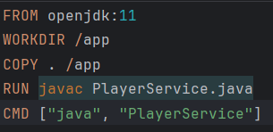
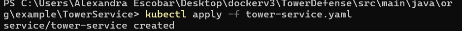
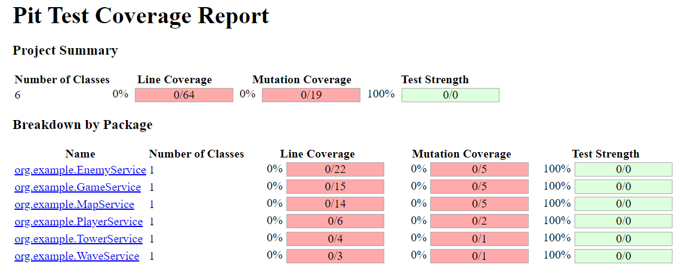
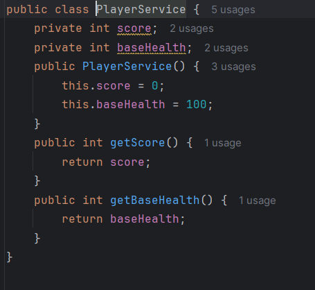
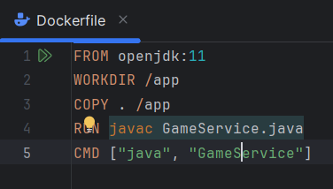

# Descripción del proyecto: V3
El juego "Tower Defense" es un videojuego de consola donde el jugador debe defender su base de
oleadas de enemigos colocando torres en lugares estratégicos del mapa. El proyecto incluirá el uso de
mocks, stubs y fakes para pruebas unitarias y de integración utilizando Mockito y pruebas de mutación.
Estructura del proyecto
Clases principales:

1. Microservicio de Juego (GameService): Maneja la lógica general del juego.
2. Microservicio de Mapa (MapService): Gestiona la representación y manipulación del mapa del juego.
3. Microservicio de Enemigos (EnemyService): Gestiona la creación y el comportamiento de los
enemigos.
4. Microservicio de Torres (TowerService): Gestiona la creación y el comportamiento de las torres.
5. Microservicio de Oleadas (WaveService): Maneja la lógica de las oleadas de enemigos.
6. Microservicio de Jugador (PlayerService): Representa al jugador y sus estadísticas.

Entrada y salida

Entrada:

- Comandos del usuario para colocar torres, iniciar oleadas, etc.
- Datos iniciales del mapa y configuración de juego.

Salida:

- Estado del juego después de cada comando.
- Puntuación y estado de salud de la base.

## Crear Dockerfile para cada microservicio

### Dockerfile para GameService

### Dockerfile para MapService

### Dockerfile para PlayerService

### Dockerfile para TowerService

### Dockerfile para WaveService

### Dockerfile para EnemyService

## Crear Docker Compose para microservicios

## Crear archivos de servicio para Kubernetes

## Aplicar los archivos de configuración en Kubernetes

###  GameService
kubectl apply -f game-deployment.yaml

kubectl apply -f game-service.yaml

### MapService
kubectl apply -f map-deployment.yaml

kubectl apply -f map-service.yaml

### PlayerService
kubectl apply -f player-deployment.yaml

kubectl apply -f player-service.yaml

### TowerService
kubectl apply -f tower-deployment.yaml

kubectl apply -f tower-service.yaml

### WaveService
kubectl apply -f wave-deployment.yaml

kubectl apply -f wave-service.yaml

### EnemyService
kubectl apply -f enemy-deployment.yaml

kubectl apply -f enemy-service.yaml

## Verificar el estado del despliegue

kubectl get pods

kubectl get services

## Implementación de pruebas

Usar mockito para pruebas unitarias y de integración

Clase de prueba con Mockito

## Configuración de Pitest en Gradle

### Ejecutar Pitest con Gradle

# Paso a paso para completar el proyecto
## 1. Preparación del entorno:
### Instalar Docker, Docker Compose y Minikube (o un clúster Kubernetes equivalente).

Verificamos la version de cada uno

## 2. Desarrollar los microservicios:
### Crear los archivos Java para cada microservicio (GameService, MapService, PlayerService,TowerService, WaveService).

- GameService

    

- MapService

    

- PlayerService

    

- TowerService

    

- WaveService

    

## 3. Configurar Docker:
### Crear un Dockerfile para cada microservicio.
- GameService

    

- MapService

    

- PlayerService

    

- TowerService

    

- WaveService

    
### Construir las imágenes Docker usando el comando docker build.
- GameService

    

- MapService

    

- PlayerService

    

- TowerService

    

- WaveService

    
    
## 4. Configurar Docker Compose:
### Crear un archivo docker-compose.yml para definir cómo los contenedores interactuarán entre sí.

docker-compose.yml

### Levantar los servicios definidos en Docker Compose usando docker-compose up.

## 5. Desplegar en Kubernetes:
### Crear archivos de despliegue (deployment.yaml) y servicio (service.yaml) para cada microservicio.

- GameService

    

- MapService

    

- PlayerService

   

- TowerService

    

- WaveService

    
    

###  Aplicar las configuraciones de Kubernetes usando kubectl apply.

- GameService

    

- MapService

    

- PlayerService

   

- TowerService

    

- WaveService

    

## 6. Verificar despliegue:
### Usar comandos kubectl para verificar que los pods y servicios estén funcionando correctamente (kubectl get pods, kubectl get services).

- kubectl get pods
    
- kubectl get services
    
## 7. Implementar pruebas:
### Escribir pruebas unitarias e integración usando Mockito.

- GameServiceTest

    

- MapServiceTest

    

- PlayerServiceTest

   

- TowerServiceTest

    

- WaveServiceTest
    
    

### Configurar y ejecutar pruebas de mutación para asegurar la robustez del código.

#### Configurar build.gradle

#### Resultado de las pruebas

#### Resultado de las pruebas corregidas
